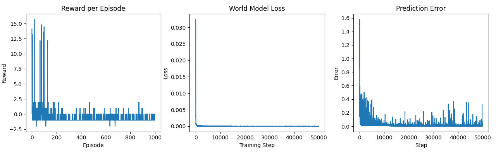

# QACA: Quantum-Assisted Cognitive Agent

QACA is an experimental cognitive agent architecture combining predictive world models, value-based planning, and quantum-assisted trajectory search.

The system demonstrates a model-based learning agent capable of predicting environment dynamics and planning actions using internal simulation.

## Architecture

## Components

environment/
GridWorld simulation used for experimentation.

agent/
Neural models representing internal state, world dynamics, value estimation, and meta-state monitoring.

quantum/
Quantum-inspired planner using a QAOA-style circuit.

training/
Training logic for world and value models.

simulation/
Training loop and evaluation.

## Features

- Predictive world modeling
- Internal state memory
- Meta-state monitoring via prediction error
- Value-based planning
- Quantum-inspired trajectory optimization
- Online training architecture

## Example Training Results

World model loss rapidly converges while prediction error decreases, demonstrating accurate learning of environment dynamics.

Example training curves:

## Running the Project

Install dependencies:

pip install -r requirements.txt

Run the simulation:

python -m simulation.run_episode

## Future Work

- larger environments
- robotics simulation
- real quantum hardware backends
- multi-agent environments
