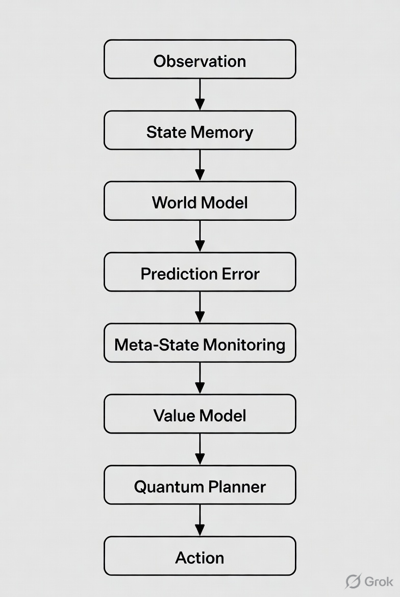
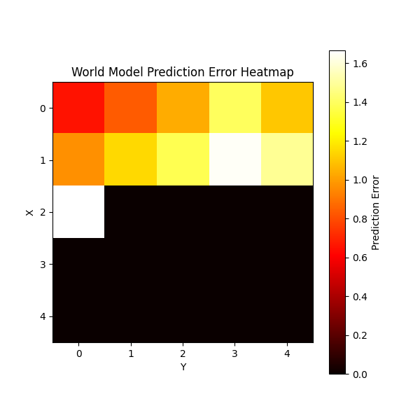
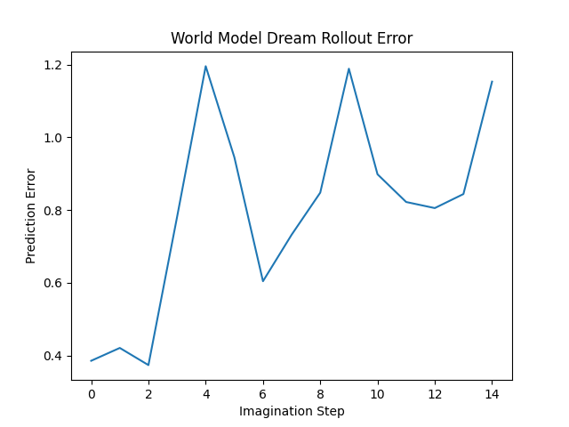
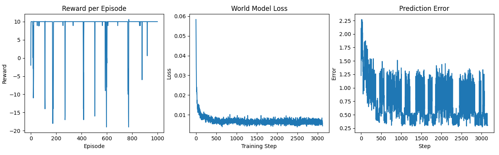

# QACA: Quantum-Assisted Cognitive Agent

QACA explores a model-based cognitive agent architecture that learns a predictive world model of its environment and performs planning through internal simulation over learned dynamics.

## Mathematical Formulation

The Quantum Assisted Cognitive Agent (QACA) is a model-based cognitive architecture composed of the following components:

- latent state representation
- world model
- prediction error monitoring
- value learning
- trajectory planning
- quantum-inspired optimization

---

### Environment

The environment is modeled as a Markov Decision Process

$$
\mathcal{M} = (\mathcal{S}, \mathcal{A}, P, R)
$$

where

- $\mathcal{S}$ : state space  
- $\mathcal{A}$ : action space  
- $P(s'|s,a)$ : transition dynamics  
- $R(s,a)$ : reward function  

---

### Latent State Representation

The agent maintains an internal latent state

$$
s_t \in \mathbb{R}^d
$$

State updates follow

$$
s_t = f_\theta(o_t, a_{t-1}, s_{t-1})
$$

where

- $o_t$ : observation  
- $a_{t-1}$ : previous action  
- $f_\theta$ : state update network  

---

### World Model

The world model predicts the next latent state

$$
\hat{s}_{t+1} = g_\phi(s_t, a_t)
$$

Training minimizes prediction error

$$
\mathcal{L}_{world} =
\| s_{t+1} - \hat{s}_{t+1} \|^2
$$

---

### Prediction Error

Prediction error measures the discrepancy between predicted and actual states

$$
\epsilon_t =
\| s_{t+1} - \hat{s}_{t+1} \|
$$

This signal is used as a meta-cognitive feedback signal.

---

### Meta State

The agent computes a meta-state

$$
m_t = h_\psi(s_t, \epsilon_t)
$$

which represents internal uncertainty and model reliability.

---

### Value Function

The value function estimates expected discounted reward

$$
V(s_t) =
\mathbb{E}
\left[
\sum_{k=0}^{\infty}
\gamma^k r_{t+k}
\right]
$$

Training uses temporal difference learning

$$
V(s_t) \leftarrow r_t + \gamma V(s_{t+1})
$$

Loss function

$$
\mathcal{L}_{value} =
(V(s_t) - (r_t + \gamma V(s_{t+1})))^2
$$

---

### Trajectory Planning

The planner evaluates action sequences

$$
\tau = (a_t, a_{t+1}, ..., a_{t+H})
$$

Future states are simulated using the world model

$$
s_{t+1} = g_\phi(s_t, a_t)
$$

$$
s_{t+2} = g_\phi(s_{t+1}, a_{t+1})
$$

The trajectory value is

$$
J(\tau) = V(s_{t+H})
$$

The optimal trajectory

$$
\tau^* = \arg\max_{\tau} J(\tau)
$$

---

### Quantum-Inspired Optimization

Action trajectories are encoded as bitstrings

$$
z \in \{0,1\}^{2H}
$$

Each bit pair corresponds to one action.

The cost function is

$$
C(z) = -V(s_{t+H})
$$

A QAOA-style quantum circuit generates a probability distribution

$$
p(z)
$$

The chosen trajectory is

$$
z^* = \arg\max_z p(z)
$$

The agent executes the first action of the trajectory.

## Architecture

## Components

environment/
GridWorld simulation used for experimentation.

agent/
Neural models representing internal state, world dynamics, value estimation, and meta-state monitoring.

quantum/
Quantum-inspired planner using a QAOA-style circuit.

training/
Training logic for world and value models.

simulation/
Training loop and evaluation.

## Features

- Predictive world modeling
- Internal state memory
- Meta-state monitoring via prediction error
- Value-based planning
- Quantum-inspired trajectory optimization
- Online training architecture
  

## Experimental Analysis

The repository also includes several experimental tools for analyzing the behavior of the cognitive agent and the learned world model.

---

### Prediction Error Heatmap

Prediction error is tracked spatially across the environment to reveal regions where the learned world model is uncertain.

For each grid position $(x,y)$ the average prediction error is computed

$$
U(x,y) = \mathbb{E}[\epsilon_t \mid position=(x,y)]
$$

This produces a spatial uncertainty map of the environment.

Example visualization:

---

### Internal State Dynamics

The evolution of the latent state $s_t$ over time is recorded during training.

This produces a dynamical systems view of the agent’s internal representation:

$$
s_t = f_\theta(o_t, a_{t-1}, s_{t-1})
$$

Plotting the trajectory of $s_t$ reveals the stability and boundedness of the learned latent space.

Example:

---

### World Model Dream Rollout

To evaluate the predictive quality of the learned world model, the agent performs *imagination rollouts*.

Starting from a real state, the agent simulates future states using only the learned dynamics model

$$
s_{t+1} = g_\phi(s_t, a_t)
$$

The divergence between predicted and real trajectories is measured

$$
D_k = \| s^{real}_{t+k} - s^{pred}_{t+k} \|
$$

This evaluates how far the model can accurately simulate the future.

Example:

---

### Environment Perturbations

During training the environment is occasionally perturbed (e.g., goal relocation).

This evaluates the stability of the learned policy under non-stationary dynamics.

The agent must adapt to sudden changes while maintaining a consistent world model.

---

### Multi-Agent Dynamics

The environment supports interacting agents:

- **Agent A**: controlled by the cognitive architecture
- **Agent B**: autonomous environmental agent

This creates a simple multi-agent dynamical system where the world model must learn transition dynamics influenced by other agents.

The transition function becomes

$$
s_{t+1} = f_\theta(s_t, a_t, b_t)
$$

where $b_t$ represents the behavior of the second agent.

---

## Experimental Observations

Across training runs the following behaviors consistently emerge:

- rapid convergence of the world model loss
- decreasing prediction error over time
- stable bounded latent state dynamics
- reliable goal-reaching behavior
- short-horizon accuracy in imagination rollouts

These observations suggest that the agent successfully learns a predictive model of environment dynamics and uses it for planning.

## Example Training Results

World model loss rapidly converges while prediction error decreases, demonstrating accurate learning of environment dynamics.

Example training curves:

## Running the Project

Install dependencies:

pip install -r requirements.txt

Run the simulation:

python -m simulation.run_episode

## Future Work

- richer multi-agent environments
- continuous control tasks
- hierarchical planning over latent state dynamics
- integration with real physics simulators
- evaluation on large-scale simulated environments
